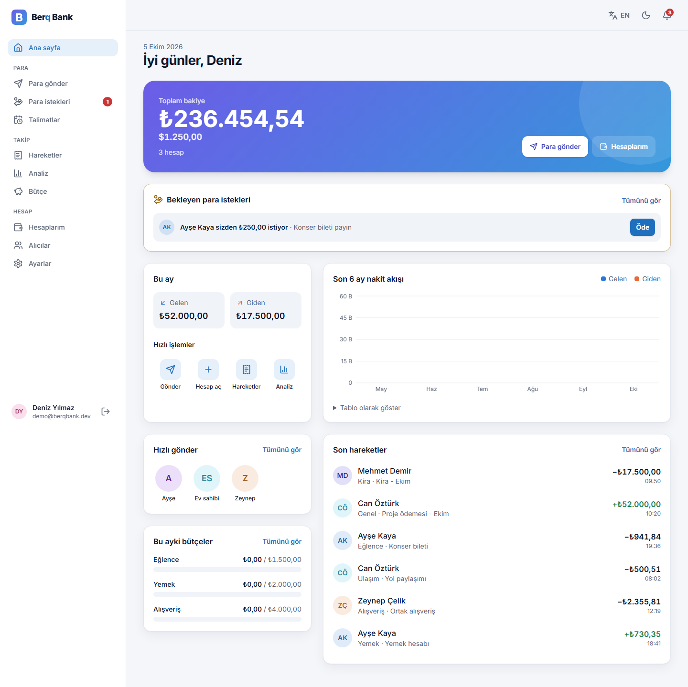
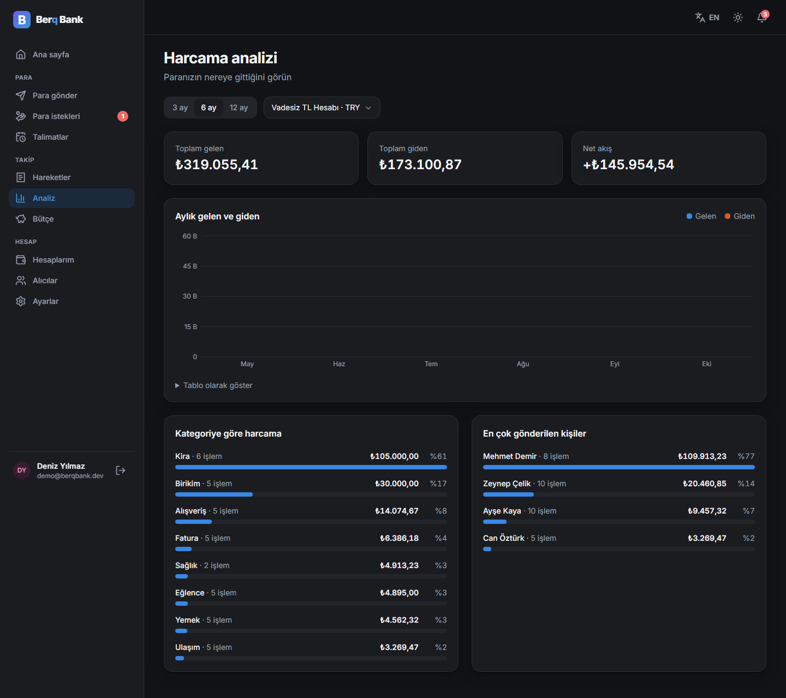
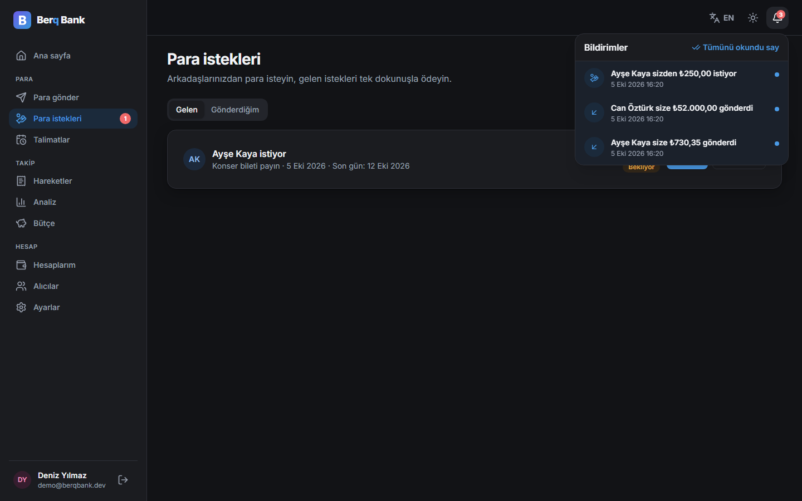
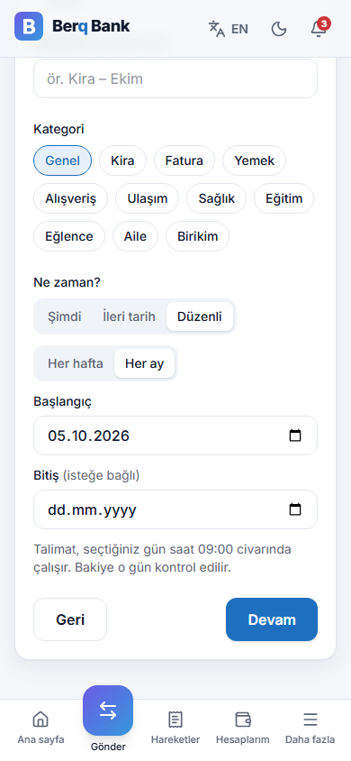
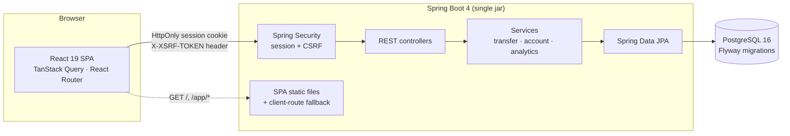

# Berq Bank — P2P Money Transfer Platform


A full-stack digital banking app: customers open accounts, send money instantly by IBAN, request money from each other, schedule recurring transfers, set budgets, get live notifications, download statements and see where their money goes. The backend focuses on what matters in a payments system — **consistency under concurrency, idempotent transfers, authorization and data minimization** — and every one of those claims is backed by a test.



| Insights (dark) | Requests + live notifications (dark) | Recurring transfer (mobile) |
|---|---|---|
|  |  |  |

## Try it in one command

No PostgreSQL or Docker needed — the dev server starts an embedded PostgreSQL 16 and loads six months of demo data:

```bash
cd frontend && npm ci && npm run build:backend      # builds the React app into the backend
cd ../p2p-transfer
./mvnw spring-boot:test-run -Dspring-boot.run.main-class=p2p_transfer.DevServer
```

Open http://localhost:8080 and click **“Demo ile giriş yap”** (`demo@berqbank.dev` / `Demo1234`).

## Features

| Page | What it does |
|---|---|
| **Landing** `/` | Product page with feature overview and security highlights |
| **Register / Login** | TCKN checksum and password strength validated client- and server-side; account lockout after 5 failed attempts |
| **Dashboard** `/app` | Total balance per currency, this month in/out, 6-month cash-flow chart, quick send, recent activity |
| **Accounts** | Multiple TRY / USD / EUR accounts with server-generated, checksum-valid IBANs; rename, copy IBAN |
| **Send money** | 4-step wizard (recipient → amount → review → done) with live recipient lookup (masked name), currency-aware source accounts, idempotent submit; send now, on a later date, or weekly/monthly; warns before a transfer pushes a budget over |
| **Money requests** | Request money by IBAN or saved recipient; the payer pays (or declines) in one tap; requests expire after 7 days |
| **Scheduled transfers** | Future-dated and recurring transfers (e.g. rent on the 3rd of every month) with pause / resume / cancel |
| **Budgets** | Monthly limits per category with progress meters; notifications at 80 % and when exceeded |
| **Notifications** | Bell with unread count; money received, requests, scheduled runs and budget alerts arrive **live** over Server-Sent Events |
| **Activity** | Search, direction / account / category / date filters kept in the URL, day grouping, pagination, Excel-ready CSV export |
| **Receipt** | Printable transfer receipt, repeat transfer, save recipient |
| **Recipients** | Saved contacts: add with IBAN verification, rename, delete (optimistic) |
| **Insights** | Monthly in/out chart, spending by category, top recipients, 3/6/12-month periods |
| **Settings** | Profile (masked TCKN), password change, theme (light/dark/system), language (TR/EN) |

## Architecture



The React app is built into the Spring Boot jar, so the API and UI share one origin: no CORS, and the session cookie can be `HttpOnly` + `SameSite=Strict`.

### How a transfer works

```
POST /api/transactions/transfer   Idempotency-Key: <uuid>
{ fromAccountId, toIban, amount, description?, category? }
  │
  ├─ 1. Session + CSRF check ................................ 401 / 403
  ├─ 2. Bean Validation: amount ≥ 0.01, ≤ 2 decimals ........ 400 VALIDATION_FAILED
  ├─ 3. Resolve receiver id by IBAN (id only, see below) .... 404 IBAN_NOT_FOUND
  ├─ 4. Lock both rows FOR UPDATE in ascending id order ..... no double spend, no deadlock
  ├─ 5. Sender must belong to the user ...................... 404 ACCOUNT_NOT_FOUND (no existence leak)
  ├─ 6. Same Idempotency-Key seen? → return the first result  200 + Idempotent-Replayed: true
  ├─ 7. Currency match, daily limit (own-account moves exempt), balance
  └─ 8. Debit, credit, write receipt with balances-after — one DB transaction
```

A subtle bug this design avoids: if an `Account` entity is loaded *before* taking the lock (paying a money request reads the requester's IBAN first, for example), a plain `FOR UPDATE` query returns the cached instance **without refreshing its balance**, silently losing a concurrent credit. Locks are therefore taken with `entityManager.refresh(account, PESSIMISTIC_WRITE)`. With the naive version `ConcurrentTransferTests` fails (the receiver ends up with 10 instead of 100).

### Side effects and live updates

```
TransferService ──publishes──▶ TransferCompleted (same DB transaction)
                                 ├─ TransferNotifier  → "money received" notification
                                 └─ BudgetService     → 80 % / 100 % budget alert (only when the threshold is crossed)
NotificationService.save ──publishes──▶ NotificationCreated
                                 └─ NotificationStreams (AFTER_COMMIT) → SSE push to every open tab of that user
```

Listeners run inside the transfer's transaction, so a rolled-back transfer never leaves a notification behind; the live push happens only after commit.

### Key decisions

| Decision | Why |
|---|---|
| Server-side session + SPA CSRF (not JWT) | Same-origin SPA: an `HttpOnly` cookie can't be stolen by XSS, logout really ends the session, and `csrf.spa()` covers the cookie's CSRF exposure |
| Pessimistic row locks with fixed lock order | Correct balances under concurrent transfers without retry loops; ordering prevents deadlocks |
| Lock = `refresh(entity, PESSIMISTIC_WRITE)` | One `SELECT … FOR UPDATE` that also reloads state, so a balance read earlier in the same transaction can never be stale |
| Scheduled transfers: `FOR UPDATE SKIP LOCKED` + key `sched-<id>-<date>` | Exactly once per run date, even with several app instances or a crash between the transfer commit and the schedule update |
| Payment request paid with key `preq-<id>` under a row lock | Double clicks or parallel requests pay a request once |
| In-memory token-bucket rate limiting | Login/register per IP, IBAN lookup and transfers per user (IBAN lookups can't be used to enumerate account owners); `429` + `Retry-After` |
| Idempotency keys (unique per sender) | A double click or a dropped connection never moves money twice; reusing a key with a different body is rejected (409) |
| Flyway with `baseline-on-migrate` | v1 created its schema with `ddl-auto=update`; existing databases upgrade in place without data loss (`LegacyDatabaseMigrationTests`) |
| RFC 9457 Problem Details + stable `code` | The UI translates errors by code (TR/EN) and maps field errors onto form inputs |
| DTO records, masked names, masked TCKN | Entities never leave the service layer; IBAN lookups reveal only `Berk T****` and the currency |
| `Clock` injected everywhere | Time-based rules (lockout, daily limit, monthly analytics) are unit-testable |
| Feature packages (`auth`, `account`, `transfer`, …) | Each feature's controller, service, repository and DTOs live together |

## Testing

| Layer | Tooling | What is covered |
|---|---|---|
| **Backend unit** | JUnit 5, AssertJ, Mockito | IBAN mod-97, TCKN algorithm, masking, CSV injection escaping, lockout timing with a mutable clock |
| **Backend integration** | Spring Boot Test, MockMvc, **embedded PostgreSQL 16** | Every endpoint through the real security chain: auth, CSRF, ownership, validation, limits, idempotency, search, CSV, analytics |
| **Concurrency** | 8–40 threads released at once | No overdraft, no deadlock on opposing transfers, one charge for concurrent retries with the same key, a money request paid once |
| **Scheduling & limits** | Injected run time, mutable `Clock` | Run-date idempotency (job twice, crash after commit), month-end anchoring (31st → Feb 28 → Mar 31), pause/resume skips missed runs, token-bucket refill |
| **Migrations** | Flyway on a v1-shaped database | Baseline upgrade keeps data, normalizes `TL → TRY`, converts local timestamps, new constraints guard future writes |
| **Frontend** | Vitest, Testing Library, MSW | API client (CSRF, retry, 401), auth redirects incl. open-redirect guard, full transfer wizard, same idempotency key on retry, scheduling from the wizard, paying/declining requests, budgets, live SSE events with a fake `EventSource`, URL-synced filters, session expiry |
| **End-to-end** | Playwright (desktop + Pixel 7) | Demo transfer → receipt → history, registration + new USD account, **two users: request → pay → notification**, budget + recurring transfer from the UI, protected routes and logout |

```bash
cd p2p-transfer && ./mvnw verify          # 172 tests — no database or Docker required
cd frontend && npm test                   # 56 tests
cd frontend && npx playwright test        # needs the dev server running (see "Try it")
```

CI runs all three on every push and pull request.

## Running it

| Goal | Command |
|---|---|
| Zero-setup demo | see **Try it in one command** |
| Against your local PostgreSQL | `createdb p2p_db`, then `DB_PASSWORD=… ./mvnw spring-boot:run` (add `-Dspring-boot.run.profiles=demo` for sample data) |
| Frontend with hot reload | run the backend on :8080, then `cd frontend && npm run dev` → http://localhost:5173 (`/api` is proxied) |
| Docker | `docker compose up --build` → http://localhost:8080 (`SPRING_PROFILES_ACTIVE=demo` for sample data) |
| API docs | http://localhost:8080/swagger-ui.html |

### Configuration

| Property / env var | Default | Meaning |
|---|---|---|
| `DB_URL`, `DB_USERNAME`, `DB_PASSWORD` | `jdbc:postgresql://localhost:5432/p2p_db`, `postgres`, — | Database connection |
| `app.transfer.daily-limit` | `50000.00` | Per-account daily limit for transfers to other people |
| `app.bank.max-accounts-per-user` | `5` | Account cap per customer |
| `app.security.max-failed-logins` / `lock-duration` | `5` / `15m` | Login lockout |
| `app.onboarding.welcome-balance` | `0` (`2500` in `demo`) | Starting balance of a new customer's first account |
| `server.servlet.session.timeout` | `15m` | Idle session timeout |
| `app.payment-requests.expiry` | `7d` | How long a money request stays payable |
| `app.scheduled-transfers.poll-interval` | `60s` | How often due scheduled transfers are executed |
| `app.rate-limit.<rule>.capacity` / `period` | login 10/1m, register 5/10m, lookup 30/1m, transfer 20/1m, payment-request 10/1m | Token-bucket limits (`app.rate-limit.enabled=false` switches them off) |

### Upgrading from v1

Point the app at your existing `p2p_db` and start it. Flyway baselines the Hibernate-generated schema and applies `V2__platform_v2.sql` and `V3__requests_notifications_schedules_budgets.sql`: existing users, accounts and transactions are kept, plaintext passwords are upgraded to BCrypt on the next successful login, and existing transactions get a reference such as `BQ000000000001`.

## API

All endpoints except `auth/register`, `auth/login`, `auth/csrf` and `public/config` require a session. State-changing requests need the `X-XSRF-TOKEN` header (value of the `XSRF-TOKEN` cookie).

| Method | Endpoint | Description |
|---|---|---|
| GET | `/api/auth/csrf` | Issue the CSRF cookie |
| POST | `/api/auth/register` | Register, open the first TRY account, sign in |
| POST | `/api/auth/login` · `/api/auth/logout` | Start / end the session |
| GET | `/api/auth/me` | Current user |
| GET · POST | `/api/accounts` | List / open accounts |
| GET · PATCH | `/api/accounts/{id}` | Get / rename an own account |
| GET | `/api/accounts/lookup?iban=` | Recipient preview: masked name + currency |
| POST | `/api/transactions/transfer` | Send money (`Idempotency-Key` header) |
| GET | `/api/transactions` | Filtered, paged history (`accountId, direction, from, to, category, q, page, size`) |
| GET | `/api/transactions/{id}` · `/api/transactions/export` | Receipt · CSV statement |
| GET · POST · PATCH · DELETE | `/api/contacts[/{id}]` | Saved recipients |
| GET | `/api/analytics/summary?accountId=&months=` | Monthly flow, categories, top recipients |
| GET · POST | `/api/profile` · `/api/profile/password` | Profile, change password |
| GET · POST | `/api/payment-requests` | List (`role=IN` or `OUT`, `status`) / create a money request |
| POST | `/api/payment-requests/{id}/pay` · `/decline` · `/cancel` | Respond to a request |
| GET · POST · PATCH · DELETE | `/api/scheduled-transfers[/{id}]` | Scheduled transfers; PATCH pauses/resumes |
| GET · PUT · DELETE | `/api/budgets[/{id}]` | Budgets with this month's spending; PUT upserts per category + currency |
| GET · POST | `/api/notifications`, `/unread-count`, `/{id}/read`, `/read-all` | Notification centre |
| GET | `/api/notifications/stream` | Live notifications (Server-Sent Events) |

## Project structure

```
p2p-transfer/                      Spring Boot 4 · Java 21
  src/main/java/p2p_transfer/
    auth/  account/  transfer/  contact/  analytics/  user/   feature packages
    request/  schedule/  budget/  notification/  ratelimit/
    common/                        IBAN, masking, TCKN validation, error model
    config/                        security, SPA serving, OpenAPI, app properties
    demo/                          demo data seeder (demo profile)
  src/main/resources/db/migration  Flyway SQL
  src/test/java/p2p_transfer/      unit, integration, concurrency, migration tests + DevServer
frontend/                          React 19 · TypeScript · Vite · Tailwind CSS 4
  src/app/                         router, providers, error boundaries
  src/features/<feature>/          pages, components, TanStack Query hooks, tests
  src/components/ui/  layout/      design system and app shell
  src/lib/                         API client, formatting, IBAN, validation
  src/i18n/                        Turkish and English (type-checked keys)
  e2e/                             Playwright specs
Dockerfile · docker-compose.yml · .github/workflows/ci.yml
```

---

Berq Bank is a portfolio project and does not move real money.
